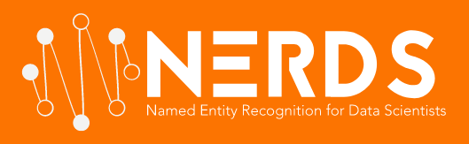

# nerds


# How to set up a DEV environment

Required Python version >= 3.6

## Setting up the environment with `pipenv`

`pipenv` is a utility that manages virtual environments and `pip` dependencies at the same time. To install it, navigate to the project's root directory and run:

```
pip3 install pipenv
```

This will make sure that `pipenv` uses your latest version of Python3, which is hopefully 3.6 or higher. Please refer to the [official website](https://docs.pipenv.org/) for more information on `pipenv`.

A Makefile has been created for convenience, so that you can install the project dependencies, download the required models, test and build the tool easily. Note that this is the preferred environment setup approach, the `Pipfile` and `Pipfile.lock` files ensure that you automatically have access to the installed packages in `requirements.txt` after you do a `make install` (see below).

## Setting up the environment using `conda`

Alternatively, if you are using the [Anaconda distribution of Python](https://www.anaconda.com/), you can also use `conda` to create an environment using the following command:

```
conda create -n nerds python=3.6 anaconda
```

You can then enter the newly created conda environment using the following command. After you run the various `make ...` commands, the packages listed in `requirements.txt` and the downloaded models will only be visible inside the `nerds` environment. This approach is usually preferred since it can help prevent version collisions between different environments, at the cost of more disk space.

```
conda activate nerds
```

and exit the environment using the following command.

```
conda deactivate
```

## Makefile specifications

To install all of the required packages for development and testing run:

```
make install
```

The tool will not run without an English language model and a tagger. To download [spacy's English language model](https://spacy.io/usage/models) and [NLTK's default tagger](https://www.nltk.org/api/nltk.tag.html#nltk.tag.perceptron.AveragedPerceptron) run:

```
make download_models
```

To execute the unit tests run:

```
make test
```

Code quality checks can be run with:

```
make lint
```

A wheel distribution of this tool can be created with:

```
make dist
```

# How to write your own NER model

NERDS is a framework that provides some NER capabilities - among which the option of creating ensembles of NER models - but primarily made to be extended. In the following sections we take a look at the basic data exchange classes, and how you can use them to create your own models.

## Understanding the main data exchange classes

The NERDS master project on [elsevierlabs-os/nerds](https://github.com/elsevierlabs-os/nerds) project uses a set of custom data exchange classes `Document`, `Annotation`, and `AnnotatedDocument`. The project provided a set of conversion utilities which could be used to convert provided datasets to this format, and convert instances of these classes back to whatever format the underlying wrapped NER model needed. However, this NERDS fork on [sujitpal/nerds](https://github.com/sujitpal/nerds) eliminates this requirement -- the internal format is just a list of list of tokens (words in sentence) or BIO tags. The utility function `nerds.utils.load_data_and_labels` can read a file in CoNLL BIO format and convert to this internal format. This decision was made because 3 of the 5 provided models consume the list of list format natively, and the result is fewer lines of extra code and less potential for error.

In general, when given an input format that is not in CoNLL BIO format, the main effort in using NERDS would be to convert it to CoNLL BIO format. Once that is done, it is relatively easy to ingest it into a data and label structure, as shown below.

```python
from nerds.utils import load_data_and_labels

data, labels = load_data_and_labels("nerds/test/data/example.iob")
print("data:", data)
print("labels:", labels)
```

yields the following output.

```
data: [
  ['Pierre', 'Vinken', ',', '61', 'years', 'old', ',', 'will', 'join', 'the', 'board', 'as', 'a', 'nonexecutive', 'director', 'Nov', '.', '29', '.'], 
  ['Mr', '.', 'Vinken', 'is', 'chairman', 'of', 'Elsevier', 'N', '.', 'V', '.', ',', 'the', 'Dutch', 'publishing', 'group', '.']
]
labels [
  ['B-PER', 'I-PER', 'O', 'B-DATE', 'I-DATE', 'I-DATE', 'O', 'O', 'O', 'O', 'O', 'O', 'O', 'O', 'O', 'B-DATE', 'I-DATE', 'I-DATE', 'O'], 
  ['B-PER', 'I-PER', 'I-PER', 'O', 'O', 'O', 'B-ORG', 'I-ORG', 'I-ORG', 'I-ORG', 'I-ORG', 'O', 'O', 'B-NORP', 'O', 'O', 'O']
]
```

## Extending the base model class

The basic class that every model needs to extend is the `NERModel` class in the `nerds.models` package. The model class implements a `fit - predict` API, similarly to `sklearn`. To implement a new model, one must extend the following methods at minimum:

*  `fit(X, y)`: Trains a model given a list of list of tokens X and BIO tags y.
*  `predict(X)`: Returns a list of list of BIO tags, given a list of list of tokens X.
*  `save(dirpath)`: Saves model to directory given by dirpath.
*  `load(dirpath)`: Retrieves model from directory given by dirpath.

As a best practice, I like to implement a single NER model (or group of related NER models) as a single file in the `models` folder, but have it be accessible from client code directly as `nerds.models.CustomNER`. You can set this redirection up in `nerds/models/__init__.py`.

# Running experiments

There are two examples of running experiments using NERDS. We will continue to update these examples as more functionality becomes available.

* [examples/GMB](examples/GMB)
* [examples/BioNLP](examples/BioNLP)

# Contributing to the project

New models and input adapters are always welcome. Please make sure your code is well-documented and readable. Before creating a pull request make sure:

* `make test` shows that all the unit test pass.
* `make lint` shows no Python code violations.

The [CONTRIBUTING.md file](docs/CONTRIBUTING.md) lists contributors who have contributed to the [NERDS (elsevierlabs-os/nerds)](https://github.com/elsevierlabs-os/nerds) project.

# Changes / Improvements in this Fork

The [CHANGES.md file](docs/CHANGES.md) lists the changes and improvements that were made in this fork.

# Talks and Blogs

* \[slides\] [Slides for talk at PyData LA 2019](https://www.slideshare.net/sujitpal/building-named-entity-recognition-models-efficiently-using-nerds).
